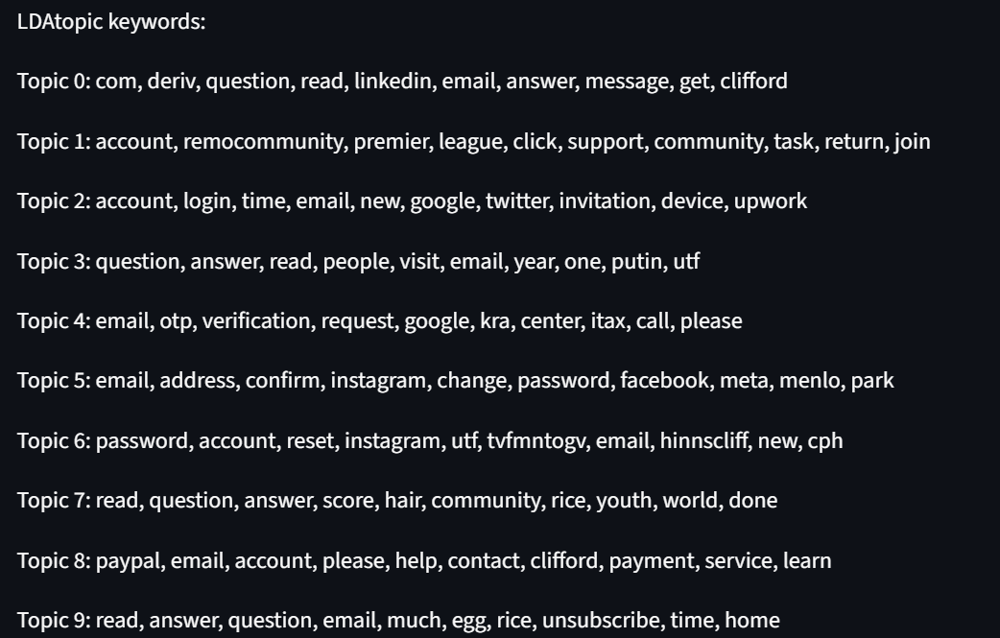

# Email Clustering and Topic Modeling Dashboard

## Overview

This project builds a comprehensive system for analyzing large collections of emails using natural language processing (NLP) and unsupervised machine learning techniques. It extracts and preprocesses email text data, applies clustering algorithms to group similar emails, performs topic modeling to discover underlying themes, and presents results through an interactive Streamlit dashboard with insightful visualizations.

---
## Features

- Connects to Gmail via IMAP to fetch emails securely.
- Cleans and preprocesses email content by removing HTML tags, stopwords, non-alphabetic characters, and performs lemmatization.
- Extracts textual features using TF-IDF vectorization with unigrams and bigrams.
- Applies K-means clustering to segment emails into meaningful groups.
- Uses Latent Dirichlet Allocation (LDA) to identify key topics within each cluster.
- Visualizes cluster assignments in two dimensions using t-SNE.
- Interactive dashboard to explore cluster sizes, topic keywords, and visualization dynamically.
- Adjustable hyperparameters for vectorization and clustering for experimentation.

---
## Technologies Used

- Python 3.8+
- Libraries: imaplib, email, nltk, BeautifulSoup4, scikit-learn, gensim, matplotlib, seaborn, streamlit
- NLP techniques: Text cleaning, tokenization, lemmatization, TF-IDF
- Machine Learning: K-means clustering, LDA topic modeling
- Visualization: t-SNE scatter plots, Streamlit interactive UI

---
## Setup Instructions

1. Clone the repository:
git clone <repository-url>
cd email-clustering

2. Create and activate a Python virtual environment:
python -m venv venv
source venv/bin/activate # On Windows: venv\Scripts\activate

3. Install dependencies:
pip install -r requirements.txt

4. Configure email account credentials securely in `.streamlit/secrets.toml`:
email_user = "your-email@gmail.com"
email_password = "your-app-password"

5. Run the Streamlit dashboard:
streamlit run src/main.py

---
## Usage

- Upon launching, log in with your email credentials.
- Load emails and wait for preprocessing and clustering to complete.
- Adjust feature extraction and clustering parameters using sidebar controls.
- Explore clusters on the 2D t-SNE visualization colored by cluster labels.
- View top keywords for each LDA topic to understand content themes.

---
## Project Structure

- `.streamlit/` — Streamlit configuration and secrets
- `.venv/` — Python virtual environment
- `src/` — Source code folder including main app and modules
- `requirements.txt` — Python dependencies
- `pyproject.toml` — Dependency and build configuration
- `uv.lock` — UV package manager lock file
- `README.md` — This file

---
## 📸 Screenshot

---
## Future Work

- Add sentiment analysis per cluster/topic.
- Support multiple email providers beyond Gmail.
- Implement real-time incremental clustering.
- Improve UI with richer visualizations and export options.

---
## Author

Clifford Ojuka — Data Scientist / Machine Learning Engineer

---